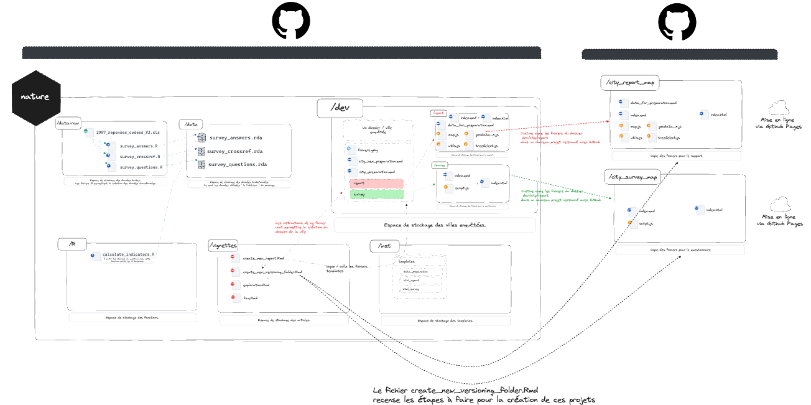

<!-- README.md is generated from README.Rmd. Please edit that file -->
<!-- badges: start -->

[](https://github.com/BENEVFR/nature/actions/workflows/R-CMD-check.yaml)
<!-- badges: end -->

# nature

L’université de Paris-Est Créteil (UPEC) a mené une enquête sur la
perception du bien-être des citoyens dans leur ville, notamment en ce
qui concerne la végétalisation. Elle souhaite reproduire cette enquête à
une échelle plus large afin que les agglomérations puissent prendre des
décisions en conséquence. Le questionnaire existe et a déjà été
approuvé. Il est prêt à être déployé.

Ce package contient les données brutes d’une enquête déjà réalisée
auprès de 2000 personnes, ainsi que les premieres explorations en termes
de recherche sur les visualisations qui pourront etre mis en place à
destination des maires des futures villes enquétées.

# Documentation :

## pkgdown :

<https://presta-upec-nature-typeform-thinkr-missions-c6ab7ae0d946c313971.pages.thinkr.fr>

## coverage :

<https://presta-upec-nature-typeform-thinkr-missions-c6ab7ae0d946c313971.pages.thinkr.fr/coverage.html>

## Fonctionnement général du projet

> Pour agrandir l’image, clique droit puis “Ouvrir l’image dans un
> nouvel onglet”



# installation

depuis les sources

``` r
remotes::install_local()
```
