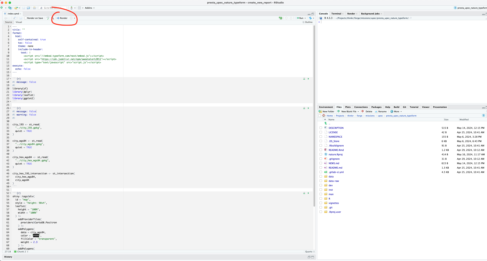

```{r, include = FALSE}
knitr::opts_chunk$set(
  collapse = TRUE,
  comment = "#>"
)
```

```{r setup}
# library(nature)
```

Plusieurs étapes sont nécessaires pour **créer une nouvelle enquête**: 

1) Préparation des données cartographique,

2) Création du questionnaire

3) Création du rapport

## Préparation des données cartographiques

Afin de créer une nouvelle enquête, pour une nouvelle ville, il faut suivre les instructions suivantes : 

### Création d'un nouveau dossier (ville) dans ce package

Nous allons créer un nouveau dossier qui contiendra l'ensemble des fichiers et données pour l'enquête.

```{r, eval=FALSE}
le_nom_de_la_ville <- "Rennes"

dir.create(
  path = file.path(
    "..", "dev", tolower(le_nom_de_la_ville)
  )
)
```

### Récupération des fichiers templates

Il existe deux fichiers qui contiennent l'ensemble des instructions R pour créer les cartes. 

Copions ces fichiers dans le nouveau dossier : 

```{r, eval=FALSE}
templates <- list.files(
  system.file(
    "templates", "data_preparation",
    package = "nature"
  ),
  full.names = TRUE
)

file.copy(
  from = templates,
  to = file.path(
    "..", "dev", tolower(le_nom_de_la_ville)
  )
)
```

### Sélection des données carto

Cette étape consiste à suivre les instructions R contenues dans les fichiers copiés. 

Le premier fichier à suivre est le fichier `city_preparation.qmd`. 

Il contient les instructions pour sélectionner les contours de la ville à enquêter. 

**/!\ Attention à bien modifier ce fichier avec le nom de la ville enquêtée. **

```{r, eval=FALSE}
rstudioapi::navigateToFile(
  file = file.path(
    "..", "dev", tolower(le_nom_de_la_ville), "city_preparation.qmd"
  ),
  line = 1
)
```

## Création du questionnaire

L'étape suivante consiste à créer le fichier HTML qui contiendra la carte pour le questionnaire. 

### Création du fichier HTML

Créons un dossier qui contiendra ce document : 

```{r, eval=FALSE}
dir.create(
  path = file.path(
    "..", "dev", tolower(le_nom_de_la_ville), "survey"
  )
)
```

Copions dans notre nouveau dossier le document :

```{r, eval=FALSE}
templates <- list.files(
  system.file(
    "templates", "html_survey",
    package = "nature"
  ),
  full.names = TRUE
)

file.copy(
  from = templates,
  to = file.path(
    "..", "dev", tolower(le_nom_de_la_ville), "survey"
  )
)
```

Le fichier `index.qmd` du dossier `survey` est le fichier qui va générer le fichier HTML avec la carte. 

Ouvrir le fichier et `render` le fichier :

**/!\ Modifier l'url du typeform si besoin**

{fig-alt="Render a quarto file." width=100%}

```{r, eval=FALSE}
rstudioapi::navigateToFile(
  file = file.path(
    "..", "dev", tolower(le_nom_de_la_ville), "survey", "index.qmd"
  ),
  line = 1
)
```

Cette opération doit générer un fichier `index.html`.

### Déployer la carte

Nous allons maintenant mettre en ligne la carte.

#### Création du repo Github

Suivre les étapes de la vignette `Créer et versionner un dossier avec Github` jusqu'à la fin de la deuxième étape.

### Copie des fichiers

Dans le nouveau projet Rstudio, copier / coller le contenu du dossier `survey` :

```{r, eval=FALSE}
list.files(
  file.path(
    "..", "dev", tolower(le_nom_de_la_ville), "survey"
  )
)
```

Le nouveau projet doit contenir, au minimum, le fichier `index.html` et le fichier `script.js`.

#### Envoyer sur Github les fichiers

Suivre ensuite la troisième étape de la vignette `Créer et versionner un dossier avec Github` pour envoyer sur Github les fichiers.

#### Créer et mettre en ligne la carte

Suivre ensuite la quatrième étape de la vignette `Créer et versionner un dossier avec Github` mettre en ligne la carte.

