```{r, include = FALSE}
knitr::opts_chunk$set(
  collapse = TRUE,
  comment = "#>"
)
```

Cette vignette permet de suivre les étapes à la création d'un repo (dossier) versionné avec Github.

## Première étape: créer un repo sur Github 

Se rendre sur [Github](https://github.com/) puis créer un nouveau répertoire (*repository*) :

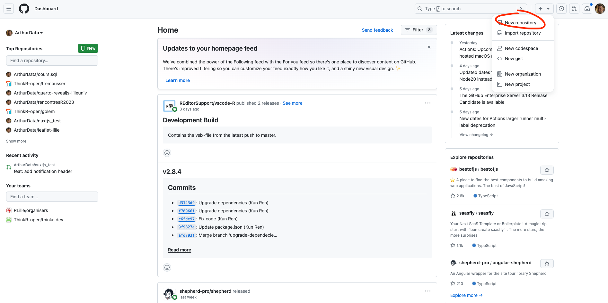{width=100%}
Sur cette nouvelle page, nous allons renseigner les informations concernant le repo. 

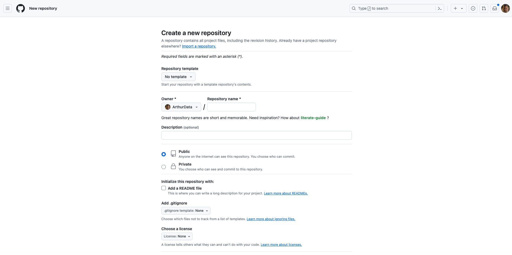{fig-alt="Render a quarto file." width=100%}

Pour celà, il faudra : 

- **Donner un nom au repo** : Pour faire la distinction entre le repo qui contient la carte pour le questionnaire, de celui qui contient le raport, nous recommandons la convention suivante: 

  * [city]_survey_map (lille_survey_map) : nom du repo qui contient la carte pour le questionnaire 

  * [city]_report_map (lille_report_map) : nom du repo qui contient le rapport

- Une description peut, éventuellement, être ajoutée. 

- Le repo **doit être en _public_** afin de pouvoir publier la page qui contiendra la carte.

- **Laissez décochées le reste des informations**.

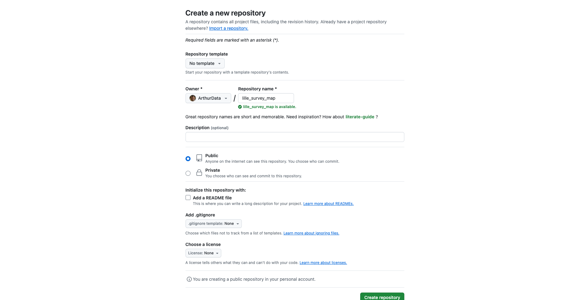{fig-alt="Render a quarto file." width=100%}

Une fois toutes les informations saisies, cliquer sur le bouton de création. 

## Deuxième étape: cloner le repo sur Rstudio

Sur cette nouvelle page, nous allons récupérer l'url du nouveau projet : 

Copier le lien HTTPS du repo : 

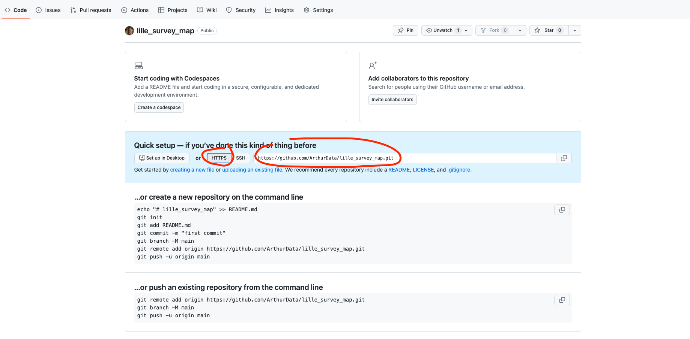{width=100%}
Une fois le lien copié, se rendre sur Rstudio et créer un nouveau projet :

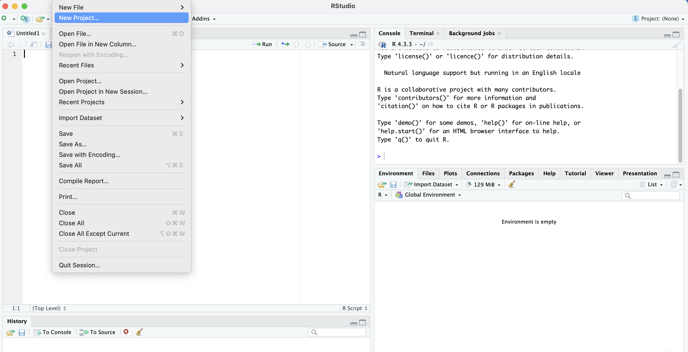{width=100%}

Sur la prochaine interface, choisir `Version Control` :

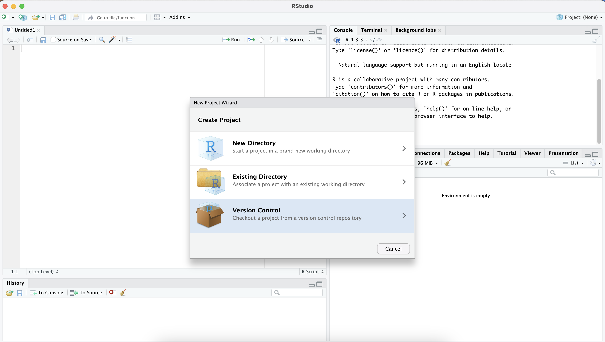{width=100%}

Puis choisir `Git` :

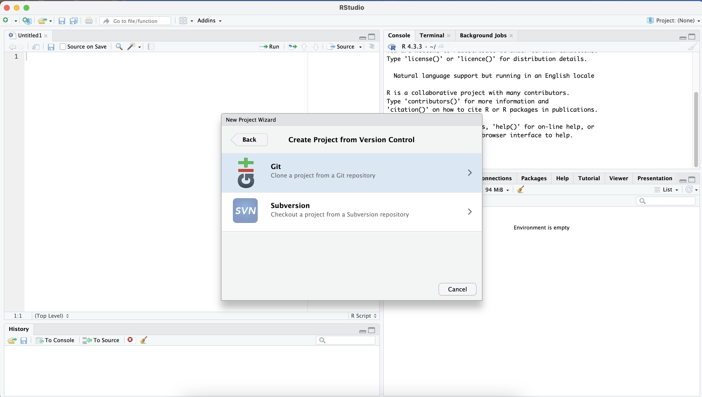{width=100%}
Coller le lien du projet dans `Repository URL` :

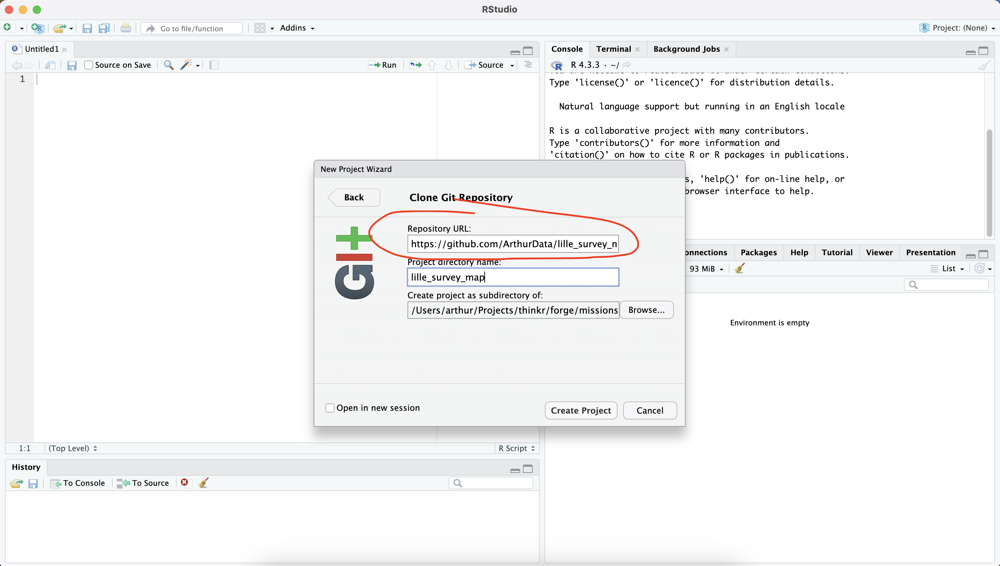{width=100%}
Puis cliquez sur `Create project`. La session Rstudio va redémarrer à l'intérieur du projet :

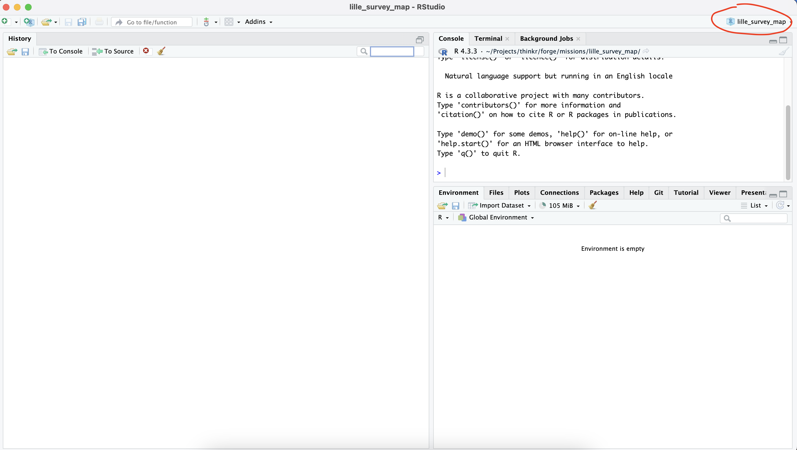{width=100%}

## Troisième étape: envoyer sur Github les modificiations

Dans le Panel `Git`, cliquez sur le bouton `Diff` :

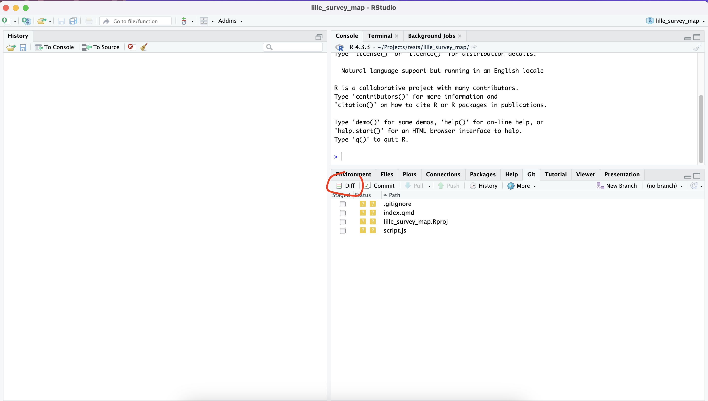{width=100%}
Cochez l'ensemble des fichiers à envoyer sur Github. 

Ajoutez un message de `commit` puis cliquez sur le bouton `commit`.

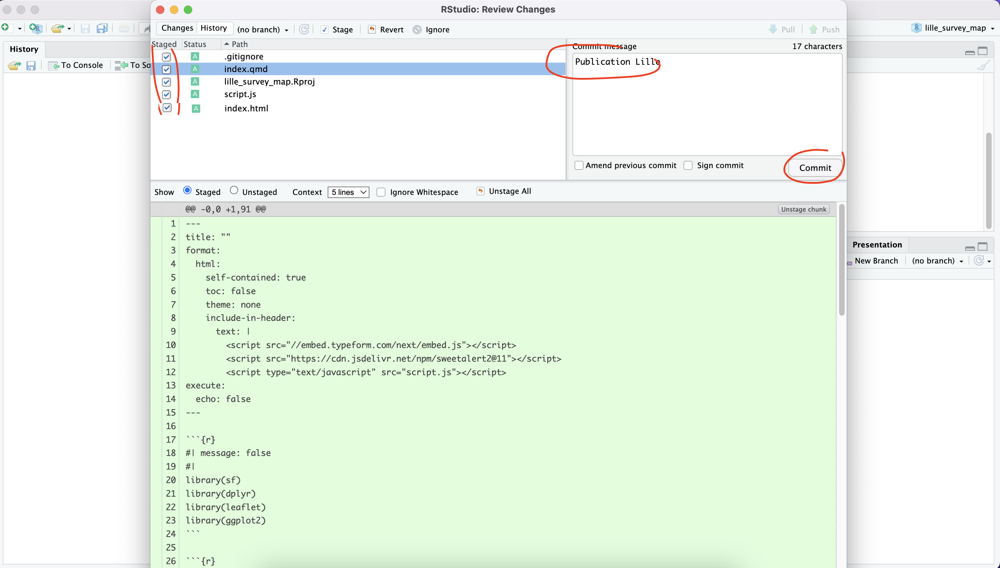{width=100%}
Ensuite, cliquez sur le bouton `push`. Une fenêtre de confirmation doit s'ouvrir.  

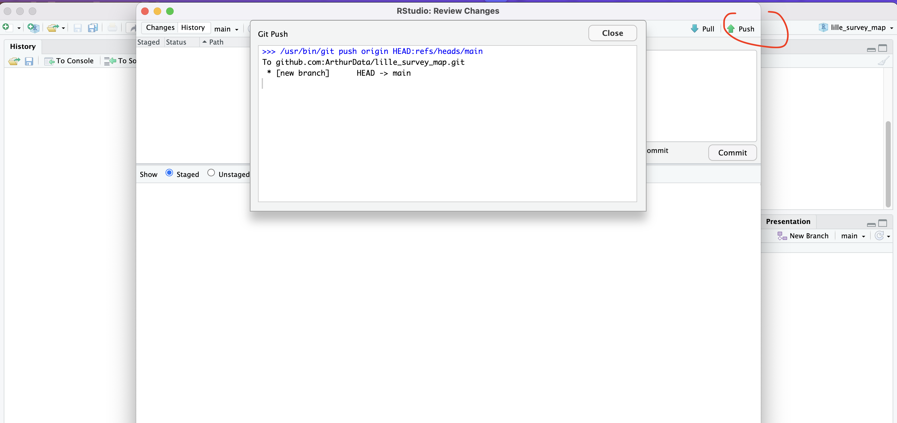{width=100%}

La liste des fichiers envoyés doit être visible sur le Github du projet.

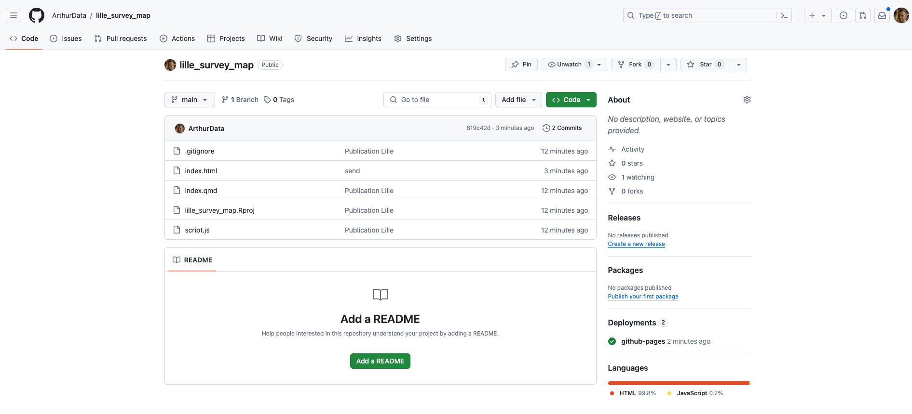{width=100%}


## Quatrième étape : déployer sur Github

Se rendre sur [Github](https://github.com/), puis dans l'onglet `Settings` et dans le menu `Pages` :

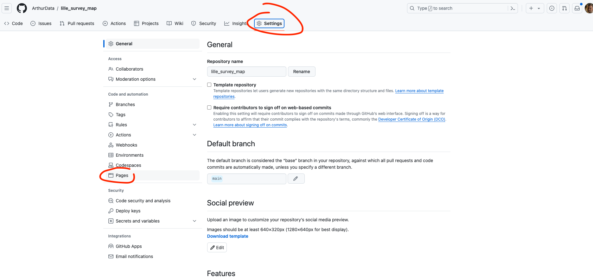{width=100%}

Sélectionner la branche `main` puis `root` :

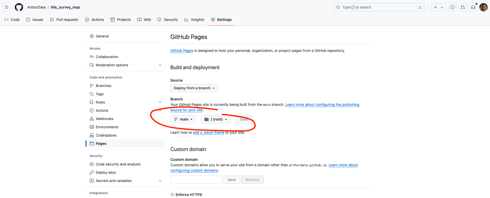{width=100%}
Patientez 5 minutes avant la mise en ligne du fichier. Rafraîchir la page si besoin : 

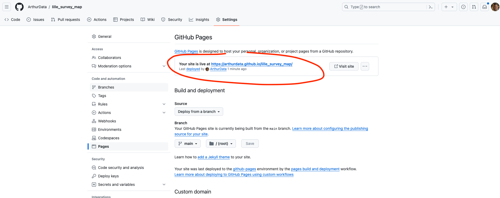{width=100%}
Le fichier doit être accessible sur l'url indiquée par Github.
