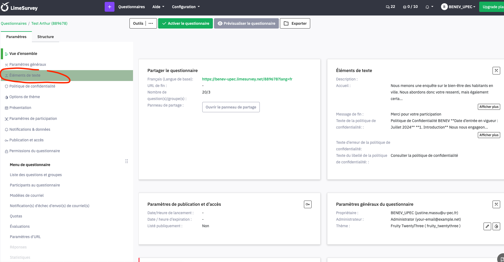
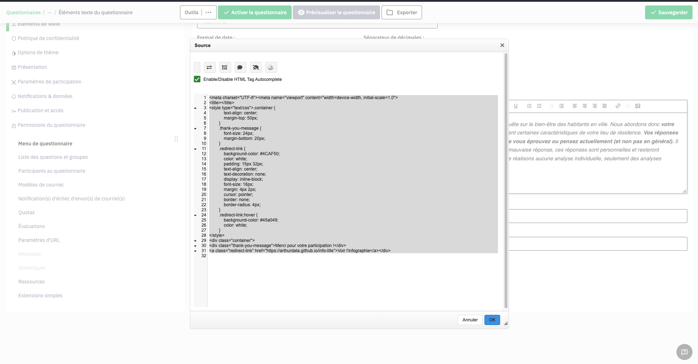
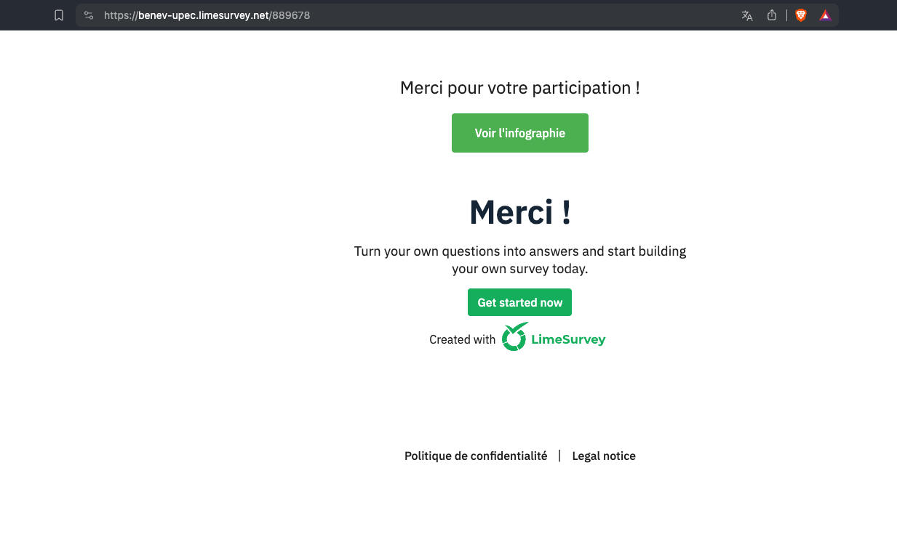
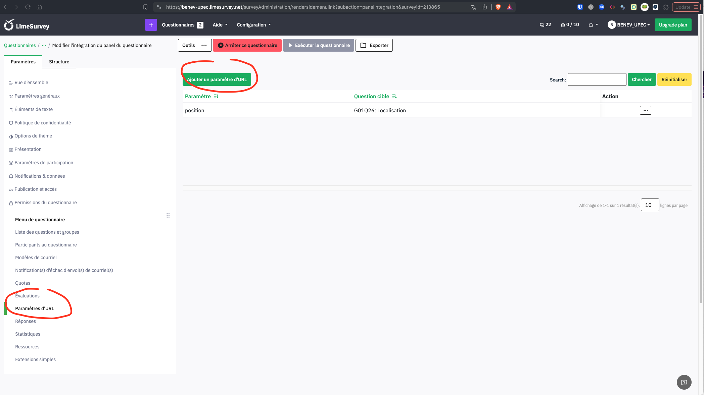
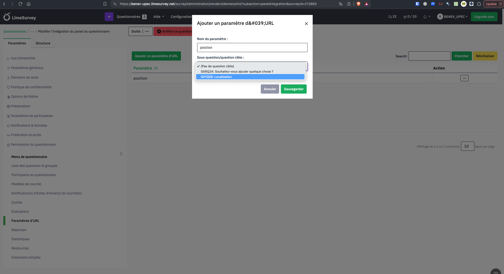
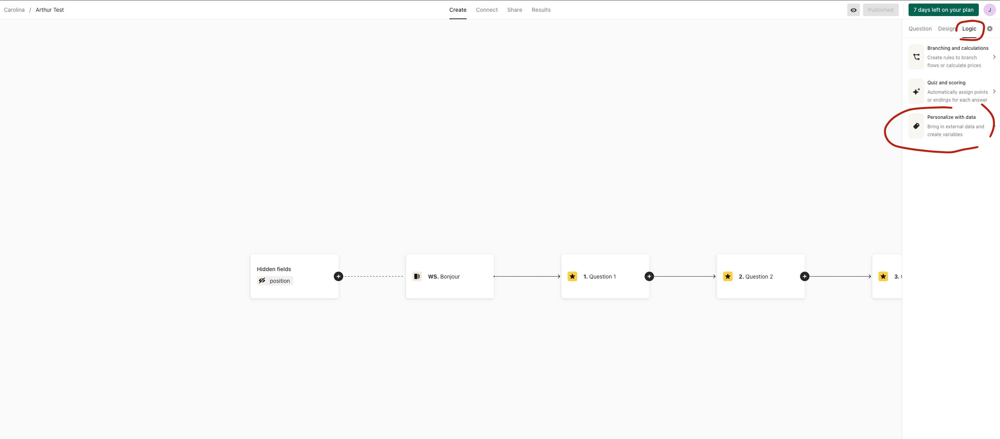
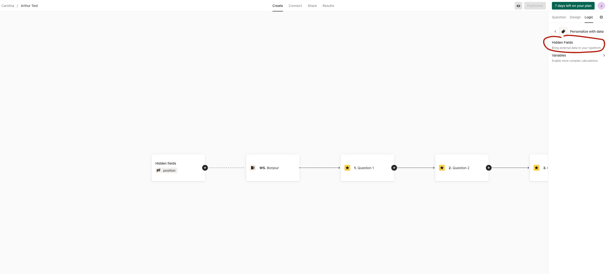
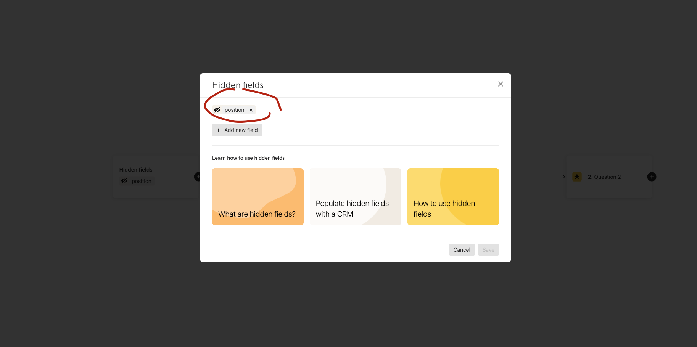

```{r, include = FALSE}
knitr::opts_chunk$set(
  collapse = TRUE,
  comment = "#>"
)
```

## Comment modifier le texte présent dans la pop-up au moment de collecter les données ?

Avant de collecter les données des répondants, une pop-up demande leur accord. En cas de refus, la page est désactivée. Sinon, le répondant est invité à sélectionner sa zone d'habitation avant d'être redirigé vers le questionnaire.

Jusqu'à présent, le texte est en _lorem ipsum_. Il s'agit d'un texte illustratif. 

Il existe deux façons de le modifier : 

- Dans le dossier `inst/templates/html_survey`, le fichier `script.js` contient le code pour modifier ce texte. Il s'agit du fichier "générique" qui sera copié/collé dans l'ensemble des futurs dossiers des villes. 

- Il est également possible de modifier le texte directement dans le dossier d'une ville. Par exemple, lors de la création d'une enquête pour Lille, un dossier `lille` sera ajouté dans `dev`. Lors de la création du questionnaire, un dossier `survey` est ajouté avec une copie du fichier `script.js`. Il est possible de modifier ce fichier dans le dossier `dev/lille/survey`. Le texte sera alors modifié pour Lille uniquement.


## Comment gérer la redirection vers une infographie à l'issue de mon questionnaire Limesurvey ?

Dans LimeSurvey, pour ajouter à la fin du questionnaire, une redirection vers une infographie, il faut se rendre sur l'onglet `Éléments de texte` dans la barre de menu latérale.

{width=100%}

Il faut ensuite modifier le `message de fin`. 

Par défaut, la page de fin dans LimeSurvey est très "discrete". 

Afin de produire une - belle page - avec un bouton de redirection, il est recommandé de modifier le message de fin en cliquant sur l'icône `Source`, puis d'ajouter :

```
<meta charset="UTF-8"><meta name="viewport" content="width=device-width, initial-scale=1.0">
<title></title>
<style type="text/css">.container {
            text-align: center;
            margin-top: 50px;
        }
        .thank-you-message {
            font-size: 24px;
            margin-bottom: 20px;
        }
        .redirect-link {
            background-color: #4CAF50;
            color: white;
            padding: 15px 32px;
            text-align: center;
            text-decoration: none;
            display: inline-block;
            font-size: 16px;
            margin: 4px 2px;
            cursor: pointer;
            border: none;
            border-radius: 4px;
        }
        .redirect-link:hover {
            background-color: #45a049;
          	color: white;
        }
</style>
<div class="container">
<div class="thank-you-message">Merci pour votre participation !</div>
<a class="redirect-link" href="https://arthurdata.github.io/info-lille">Voir l'infographie</a></div>

```

{width=100%}
**Attention**: La dernière ligne du code précédent contient l'url de redirection. 

Il faudra modifier `href="https://arthurdata.github.io/info-lille"` par la nouvelle url : 

```
<a class="redirect-link" href="nouvelleurl">Voir l'infographie</a></div>
```

Cela permet de générer une belle page de fin : 

{width=100%}

## Comment ajouter la position dans une URL ? 

### Dans LimeSurvey

Par défaut, l'information de la position n'existe pas dans une url LimeSurvey. 

Pour celà, il faut modifier le fonctionnement du formulaire. 

Dans l'onglet `Paramètre d'URL` sur LimeSurvey, cliquer sur `Ajouter un paramlètre d'URL`.

{width=100%}

Il faut ensuite créer le paramètre `position` :

{width=100%}

### Dans Typeform

Par défaut, l'information de la position n'existe pas dans une url Typeform. Pour celà, il faut modifier le fonctionnement du formulaire. 

Dans l'onglet `Create` sur Typeform, se déplacer dans la partie `Logic`.

{width=100%}

Il faut ensuite ajouter une variable cachée (_hidden fields_) :

{width=100%}

Il est possible d'ajouter à ce moment l'information de la position dans l'url : 

{width=100%}

## Comment modifier le thème du rapport ? 

Quarto permet de modifier le thème utilisé dans le rapport. 

Dans l'en-tête suivante : 

```
title: "Bien-être et végétalisation"
format:
  html:
    self-contained: true
    toc: true
    toc-expand: 2
    toc-title: Naviguer dans le rapport
    theme: minty
execute:
  echo: false
params:
  city: Créteil
---
```

Le paramètre `toc: true` permet l'affichage d'une table des matières jusqu'à une profondeur de niveau 2 `toc-expand: 2`. C'est à dire jusqu'aux titres de niveau 2 (ex : ## Titre niveau 2).

Le thème du rapport peut également être modifié à partir de `theme` et en sélectionnant le thème depuis Bootswatch : [https://bootswatch.com/](https://bootswatch.com/).

Plus d'informations sont dispo ici :

https://quarto.org/docs/output-formats/html-themes.html

## Comment intégrer les données issues du questionnaire d'une ville ? 

Afin d'analyser et d'utiliser les données issues d'un questionnaire, pour une ville, nous recommandons de : 

- Dans le dossier de la ville, placez le jeu de données (Excel ou csv) dans `Report`,

- Lire les données avec la fonction adéquate, 

- Modifier le script de `data_for_map_preparation.qmd` afin d'utiliser ces données
